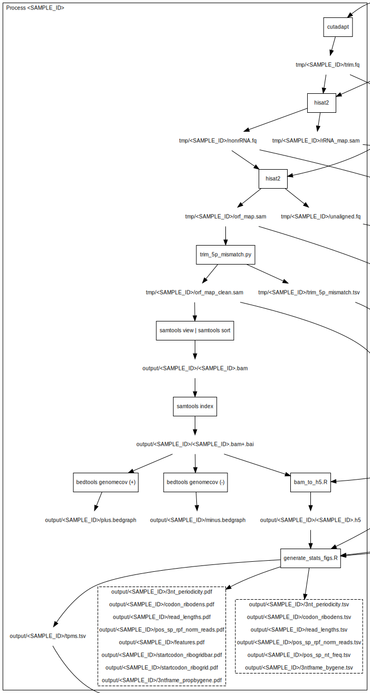

<script src="https://ajax.googleapis.com/ajax/libs/jquery/1.12.2/jquery.min.js"></script>

<script>
    $(document).ready(function() {
      $('slide:not(.title-slide, .backdrop, .segue)').append('<footer label=\"bit.ly/..."></footer>');
    })
</script>

<style>
  footer:after {
    content: attr(label);
    font-size: 12pt;
    position: absolute;
    bottom: 20px;
    left: 100px;
    line-height: 1.9;
  }
</style>

<style type="text/css">
slides > slide:not(.nobackground):after {
  content: '';
}
</style>

<div class="notes">

Bio:

Title: Experts session: Hands-on Ribo-Seq workflows - riboviz

Abstract:

Overview of riboviz workflow and features
Hands-on session to run riboviz on a small dataset
 - Run on vignette
 - Run on downsampled dataset
 - Finding and interpreting riboviz output
Overview of how to adapt to your own dataset
Question-and-answer session
Evaluation

</div>

# Hands-on Ribo-Seq workflows - riboviz


<div class="notes">

...

</div>


## Goals of this session

We aim for you to:

* Understand what riboviz does and if it would work for your needs
* Succeed in running riboviz on small datasets
* Know where to start on getting riboviz to work on new data


## Outline:

* Overview of riboviz workflow and features
* Hands-on session to run riboviz on a small dataset
  - Run on built-in "vignette" data
  - Run on downsampled dataset
  - Finding and interpreting riboviz output
* Overview of how to adapt to your own dataset
* Question-and-answer session
* Evaluation


# Overview of riboviz workflow and features

<div class="notes">

Short slide presentation that includes:
 - goals of riboviz
 - mention key design decisions
    - nextflow
    - transcriptome-centric 
    - h5 file 
    - standard file outputs of most other things (bam, bedgraph, flat .txt) 
    - apologize that we do not currently have RNA-seq in parallel
 - overview of the workflow, i.e. what happens
 - describe key ingredients 
    - data in fastq format
    - annotation files 
    - configuration file 
    - mention that we can deal with multiplexed input but do not get into detail

Next: move to hands-on

</div>

## Goals of riboviz

* end-to-end processing of Ribo-seq data
  - raw data through to useful figures
* flexible and robust
  - over library prep strategies (multiplexed, UMIs)
  - over organisms (bacteria, yeast, human, ...)
  - easy to extend
* transcript- or ORF-centric
  - splicing is a different problem
  - user chooses annotation relevant to their goals

## riboviz uses best practices

* descriptive not prescriptive
* standard file formats wherever possible (.txt, .bam, .fasta, .gff)
* all parameters are described in one config file
* tests ensure that riboviz works correctly
* scripted with a workflow management system

<font size="2">Best Practices for Scientific Computing - Wilson et al., PLoS Biology, 2014:
https://doi.org/10.1371/journal.pbio.1001745</font>


## Workflow Management Systems

Workflow Management Systems (WfMS) set up, run & monitor a defined set of tasks/processes. 

 * **run time management** (the infrastructure supporting task management & execution)

 * **portability / reproducibility** (same results, different machines)  

 * **faster troubleshooting** (with re-run options & log files)  
 
 * **easily shareable workflow scripts**  
 
Some examples are: Snakemake, Toil, cwltool and **Nextflow**


## Why not just use a script? riboviz as a case study

'riboviz' was previously controlled by a **python script** which ran other scripts (bash, python, R).

_More complex pipeline -> more admin-related development time!_ 

Nextflow handles the admin-related tasks for us (check **files exist**, create **log files**, queue & **run tasks efficiently**)

_Rather than having to create **bespoke code**, we can now use existing Nextflow features_

<font size="2">Jackson, Kavoussanakis & Wallace. (2021). Using prototyping to choose a bioinformatics workflow management system: https://doi.org/10.1371/journal.pcbi.1008622</font>


## What riboviz does well

* it works
  - on many datasets from many species
  - for many people
* count reads and periodicity on pre-annotated ORFs
* quality control figures are informative
* easy to add new data for same transcriptome/organism
* multiplexed data & UMIs work smoothly
* can trim 5' untemplated mismatches added by Superscript enzymes
* thoroughly documented

## What riboviz does not (yet) do (well)

* overlapping ORFs
  - not tested on RNA viruses
* discover new ORFs
* multimapping reads
* poor support for matched RNA-seq data
  - so export counts from riboviz for differential translation
* new organisms/annotations are still painful.

There are other tools.

We are also interested in extending riboviz for **your** needs  

## riboviz Workflow: Inputs

<div class="centered">
```{r, out.width = "800"}
knitr::include_graphics("https://raw.githubusercontent.com/FlicAnderson/LabTalk-riboviz-20210510/main/images/riboviz-workflow_inputs.png")
``` 
</div>

<div class="notes"> 

Additional organism-specific data files: ie the pipeline can run without them, but will not produce specific plots without them. 

</div>


## riboviz Workflow: Processing

<div class="centered">
```{r, out.width = "800"}
knitr::include_graphics("https://raw.githubusercontent.com/FlicAnderson/LabTalk-riboviz-20210510/main/images/riboviz-workflow_processing-aligned.png")
``` 
</div>

<div class="notes"> 

Processing:  
* Removing adapter sequences  
* Remove UMIs (Unique Molecular Identifiers) & barcodes if present  
* Demultiplex / Deduplicate reads if required  
* Need to filter out contaminant reads  
* Align reads to transcriptome   

</div>


## riboviz Workflow: Processing

<div class="centered">
```{r, out.width = "800"}
knitr::include_graphics("https://raw.githubusercontent.com/FlicAnderson/LabTalk-riboviz-20210510/main/images/riboviz-workflow_processing-ribogrid.png")
``` 
</div>

<div class="notes">

Storing data in really efficient .h5 format (hierarchical, like a file system w/ folders type of organisation)

</div>


## riboviz Workflow: Analysis

<div class="centered">
```{r, out.width = "800"}
knitr::include_graphics("https://raw.githubusercontent.com/FlicAnderson/LabTalk-riboviz-20210510/main/images/riboviz-workflow_analysis.png")
``` 
</div>

<div class="notes">

Analyse & quantify data:   
Create outputs (including for quality-control, further analysis)

One main R script which generates these plots & various analysis data; this is run for each sample, outputting .tsv and .pdf files into a folder for each sample within the overall dataset output folder.

</div>


## riboviz Workflow: Outputs

<div class="centered">
```{r, out.width = "800"}
knitr::include_graphics("https://raw.githubusercontent.com/FlicAnderson/LabTalk-riboviz-20210510/main/images/riboviz-workflow_outputs.png")
``` 
</div>  


## riboviz workflow in detail

<div class="centered">
```{r, out.width = "500"}
knitr::include_graphics("https://raw.githubusercontent.com/riboviz/workflows/main/presentations/img/workflow.svg")
``` 
</div>  

<div class="notes">
... slide notes ...
</div>


## riboviz workflow in detail, sample focus

<div class="centered">
```{r, out.width = "300"}

``` 
</div>  

<div class="notes">
Move quickly to explain with bigger fonts.
</div>

## riboviz workflow by sample

* **cutadapt** trim adapters
* **hisat2** to contaminants, align & discard
* **hisat2** to transcriptome, align & keep
* **trim_5p_mismatch** remove untemplated 5' 
* **samtools** sort and index bam file
* **bedtools genomecov** output bedgraphs
* **bam_to_h5.R** count reads by 5' position and read length
* **generate_stats_figs.R** 3nt periodicity and read counts by ORF

There are options, e.g. multiplexing.

# Hands-on session to run riboviz on a small dataset

## Run on vignette  

Welcome to Dr. Mike Jackson (EPCC, Edinburgh), who will lead the hands-on portion.

<div class="notes">
This should show what it "looks like" for riboviz to run and take about 3 minutes.

We can flush out bugs or installation problems.

We can talk through what the nextflow log means, where the output goes, and what the html output means, very briefly.
</div>


## Finding and interpreting riboviz output  

<div class="notes">
 - talk through where the files are
 - show and talk through .html output from the new downsampled dataset.
 - have one example from another full-size dataset to compare?
</div>


# Overview of how to adapt to your own dataset

<div class="notes">
focus on key considerations: 
 - annotation files (inc. contaminants) - checkfastagff tool
 - the annotation file follows the biological question and must be chosen by the user
 - read structure (adapters, UMI/regex)
 - everything goes in config.yaml
refer to documentation for config.yaml
explain example-datasets repository
</div>


# Questions & Answer Session

<div class="notes">
... slide notes ...
</div>


# Workshop Evaluation

<div class="notes">
... slide notes ...
</div>